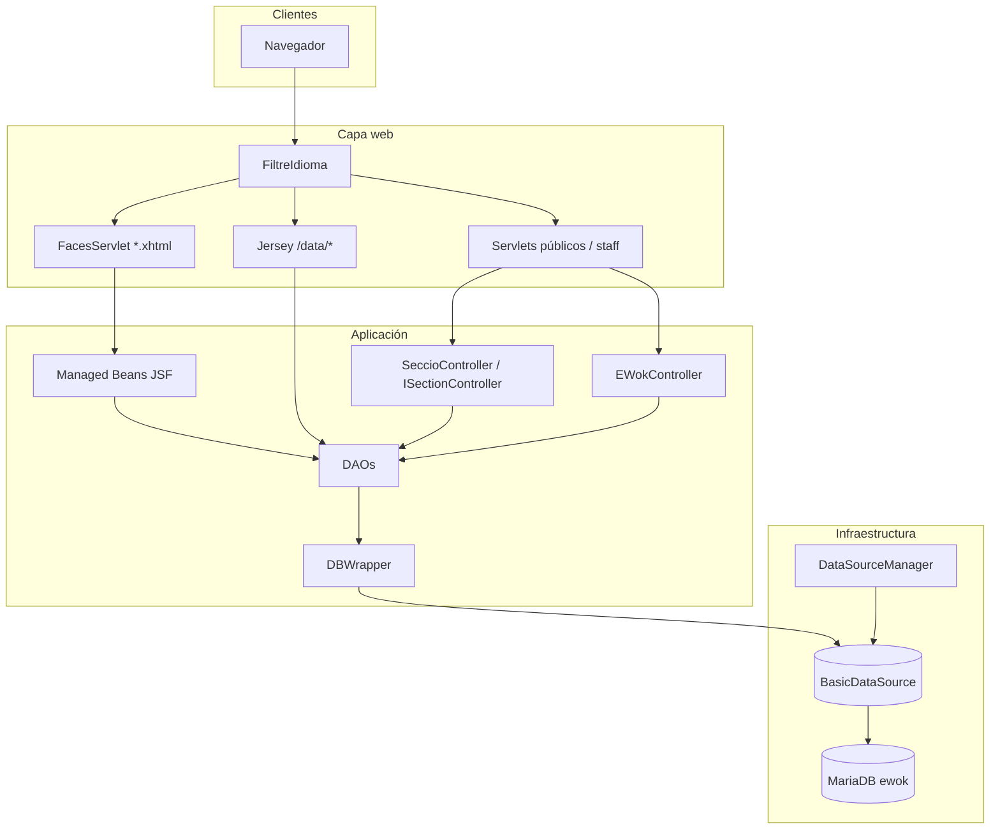
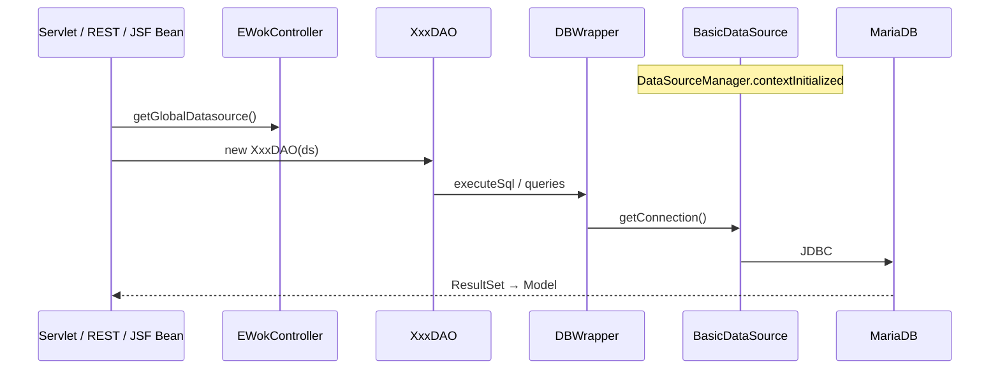

# eWok — Architecture

Aplicación web Java EE legacy empaquetada como WAR (`com.soc:ewok`). Combina **servlets + JSP** (flujo principal), **Jersey 1.19** (API JSON), y **JSF 2.2 / PrimeFaces 8** (modernización incremental).

| Capa | Tecnología |
|------|------------|
| Runtime | Java 8, Tomcat 8.5 |
| Web | Servlets 3.1, JSP, JSTL |
| API REST | Jersey 1.19 (`/data/*`) |
| UI moderna | JSF 2.2, PrimeFaces 8 (`*.xhtml`) |
| Persistencia | JDBC manual, Apache Commons DBCP |
| BD | MariaDB / MySQL (esquema `ewok`) |
| Build | Maven |

---

## Visión general



**Paquetes principales**

| Paquete | Contenido |
|---------|-----------|
| `com.soc.ewok.controller` | Servlet base, utilidades web |
| `com.soc.ewok.controller.publiccontroller` | Zona pública |
| `com.soc.ewok.controller.staffcontroller` | Zona staff (back-office) |
| `com.soc.ewok.controller.utils` | Filtros, listeners, DataSource |
| `com.soc.ewok.dao` | Acceso a datos JDBC |
| `com.soc.ewok.model` | Entidades de dominio |
| `com.soc.ewok.restws` | Recursos REST activos (scan Jersey) |
| `com.soc.ewok.bean` | Managed Beans JSF |
| `com.soc.utils` | `DBWrapper`, autenticación, validación request |

**Vistas**

| Tipo | Ubicación |
|------|-----------|
| JSP (protegidas) | `WebContent/WEB-INF/jsp/` |
| XHTML (JSF) | `WebContent/views/` |
| Despliegue | `WebContent/` → WAR (`maven-war-plugin`) |

---

## Controllers

### Jerarquía

```
javax.servlet.http.HttpServlet
└── EWokController                    ← DataSource global, i18n, forward JSP
    ├── PublicController              ← Comanda en sesión (carrito)
    │   ├── HomeServlet
    │   ├── ViewMenuServlet
    │   ├── ShoppingCart
    │   ├── CheckoutServlet
    │   └── PMostraProductesCategoria
    └── StaffController               ← Login, dispatch staff
```

Los controladores de sección staff implementan `ISectionController` y extienden `SeccioController` (acciones CRUD estándar: `llistat`, `veure`, `alta`, etc.).

### Servlet base — `EWokController`

| Responsabilidad | Detalle |
|-----------------|---------|
| DataSource | `static DataSource globalDatasource` — `getGlobalDatasource()` / `setGlobalDatasource()` |
| Navegación | `forward(path, …)` → `/WEB-INF/jsp/` + path |
| Mensajes | `addMessage`, `addI18nMessage` (request: `infoMsg`, `warnMsg`, `errorMsg`) |
| Sesión | Usuario actual, idioma |
| Bundle | `com.soc.ewok.recursos.controlador.general` |

### Públicos (`publiccontroller`)

| Clase | URL (`web.xml`) | Rol |
|-------|-----------------|-----|
| `HomeServlet` | `/home` | Página pública de inicio |
| `ViewMenuServlet` | `/ViewMenuServlet` | Catálogo / menú |
| `PMostraProductesCategoria` | `/mostraProdCateg` | Productos por categoría |
| `ShoppingCart` | `/shoppingCart` | Carrito |
| `CheckoutServlet` | `/checkout` | Checkout |
| `FotoServlet` | `/img` | Imágenes (no extiende `PublicController`) |
| `ExemplePublicEsborrar` | `/exemple` | Ejemplo / legacy |

`PublicController` gestiona `Comanda` en sesión (`comandaActual`), inicializada también por `ComandaListener`.

### Staff — `StaffController` (`/staff`)

| Aspecto | Detalle |
|---------|---------|
| Autenticación | `init-param` `autentificador` → `com.soc.utils.AutentificadorBD` |
| Login | `?accio=login` (params `usuari`, `pwd`) |
| Logout | `?accio=logout` |
| Dispatch | Primer parámetro de request cuyo nombre coincide con `ISectionController.getNomAccio()` |
| Autorización | `getRolsValids(accio)` vs roles del `Usuari` en sesión |
| Menú admin | `MenuItem` en contexto de aplicación (`items`) |

#### Controladores de sección (`staffcontroller`)

| Clase | Parámetro request | Menú / notas |
|-------|-------------------|--------------|
| `GProducteController` | `accioProductes` | `productes` — roles: admin, cuiner, caixer |
| `GPreuController` | `accioPreu` | `preus` |
| `GUsuariController` | `accioUsuari` | `usuaris` |
| `GFormaPagamentController` | `accioForPag` | `pagaments` |
| `GUnitatController` | `accioUnitat` | `unitats` |
| `GOfertaProducteController` | `accioOfertaProducte` | `ofProductes` |
| `GOfertaPuntsController` | `accioOfertaPunts` | `punts` |
| `GOfertaComandaController` | `accioOfertaComanda` | `ofComandes` |
| `GTipusProducteController` | `accioGTipusProducte` | `tipusProductes` |
| `GRolController` | `accioRol` | `rols` |
| `GFotoController` | `accioFoto` | `fotos` |
| `GClientController` | `accioClients` | Sin entrada de menú dedicada |
| `VCaixer` | `accioVistaCaixer` | Vista cajero |
| `VCuiner` | `accioVistaCuiner` | Vista cocina |
| `GVistaCuiner` | `accioVistaCuiner` | Variante vista cocina |

Legacy / ejemplo: `Exemple1StaffControllerEsborrar`, `Exemple2StaffControllerEsborrar`.

### JSF — Managed Beans (`com.soc.ewok.bean`)

| Bean | Vista | DAO / modelo |
|------|-------|----------------|
| `HomeBean` | `views/test.xhtml` | Prueba JSF |
| `ProducteBean` | `views/productes.xhtml` | `ProducteDAO.obtenirTots()` → `Producte` |

Mapeo Faces: `*.xhtml` → `javax.faces.webapp.FacesServlet`.

---

## DAOs

Ubicación: `src/com/soc/ewok/dao/`.

Patrón habitual:

```java
XxxDAO dao = new XxxDAO(EWokController.getGlobalDatasource());
List<Xxx> list = dao.obtenirTots();
```

Cada DAO encapsula SQL y usa `com.soc.utils.DBWrapper` para conexiones y ejecución. Los nombres de tablas/columnas se centralizan en `ConstantsSQL`.

| DAO | Dominio |
|-----|---------|
| `ProducteDAO` | Productos y componentes |
| `PreuDAO` | Precios |
| `TipusProducteDAO` | Tipos de producto |
| `UnitatDAO` | Unidades de medida |
| `ComponentsDAO` | Componentes |
| `ClientDAO` | Clientes |
| `UsuariDAO` | Usuarios |
| `RolDAO` | Roles |
| `FormaPagamentDAO` | Formas de pago |
| `ComandaDAO` | Pedidos |
| `LiniaComandaDAO` | Líneas de pedido |
| `OfertaProducteDAO` | Ofertas sobre producto |
| `OfertaComandaDAO` | Ofertas sobre pedido |
| `OfertaPuntsDAO` | Ofertas de puntos |
| `PuntsPendentsDAO` | Puntos pendientes |
| `PagamentDAO` | Pagos |
| `ComentariClientDAO` | Comentarios de cliente |
| `XecDAO` | Cheques |
| `ConstantsSQL` | Constantes SQL compartidas |

Operaciones típicas por DAO: `alta`, `modificar`, `esborrar`, `obtenirPerId`, `obtenirTots` (y variantes de negocio según entidad).

---

## Models

Ubicación: `src/com/soc/ewok/model/`.

POJOs de dominio usados por DAOs, servlets, REST y JSF. Sin JPA.

| Modelo | Descripción |
|--------|-------------|
| `Producte`, `ProducteComponent`, `ProducteRelacions` | Catálogo |
| `Preu`, `TipusProducte`, `Unitat`, `Components` | Precios y estructura |
| `Client`, `Adreca` | Clientes |
| `Usuari`, `Rol` | Usuarios y roles |
| `FormaPagament`, `Pagament`, `Xec` | Pagos |
| `Comanda`, `LiniaComanda` | Pedidos |
| `EEstatComanda`, `EEstatLiniaComanda` | Estados (enum-like) |
| `OfertaProducte`, `OfertaComanda`, `OfertaPunts`, `PuntsPendents` | Promociones |
| `ComentariClient`, `ComentariClient2` | Comentarios |
| `MenuItem` | Entradas del menú staff |

Constantes de rol en `Rol`: `ROL_CODI_ADMINISTRADOR`, `ROL_CODI_CUINER`, `ROL_CODI_CAIXER`.

---

## REST

**Contenedor:** `com.sun.jersey.spi.container.servlet.ServletContainer`  
**Base URL:** `/data/*` (p. ej. `http://host:8080/eWok/data/...`)  
**Scan de recursos:** `jersey.config.server.provider.packages` = `com.soc.ewok.restws`

### Recursos activos (`com.soc.ewok.restws`)

#### `VCuinerws` — `@Path("/comanda")`

| Método | Path | Descripción |
|--------|------|-------------|
| GET | `/getLComanda/{id}/num/{id2}` | Línea de comanda por id |
| GET | `/getLComandes` | Listado de líneas |
| GET | `/getLComanda/{id}/num/{id2}/stat/{stat}` | Cambio estado línea (+ lógica comanda entregada) |
| GET | `/getComanda/{id}/stat/{stat}` | Cambio estado comanda |
| GET | `/getLiniesComanda/{id}` | Líneas con `Producte` cargado |
| GET | `/getComandesVP` | Comandas validadas/preparadas |

#### `TancaLiniaWS` — `@Path("/comAct")`

| Método | Path | Descripción |
|--------|------|-------------|
| GET | `/eliminaLinia/num/{idProd}` | Quita línea del carrito en sesión |
| GET | `/modificaLinia/id/{idProducte}/qu/{quantitat}` | Modifica cantidad en carrito sesión |

Usa `PublicController.getComanda(request)` — **no persiste en BD** hasta flujos servlet de checkout.

#### `ProvaService` — `@Path("/prova")`

| Método | Path | Descripción |
|--------|------|-------------|
| GET | `/unRol` | JSON de prueba (`Rol` mock) |

### REST no registrado en `web.xml`

| Clase | Paquete | Nota |
|-------|---------|------|
| `ProductesFiltratsService` | `com.soc.ewok.restOfertaProducte` | `@Path("/productesfiltrats")` — **no** incluido en el scan Jersey actual; requiere ampliar `provider.packages` o mover la clase a `restws` |

---

## Filters

| Clase | Mapping | Función |
|-------|---------|---------|
| `FiltreIdioma` | `/*` (dispatcher REQUEST) | Resuelve idioma (`ca`, `es`, `it`, `en`) desde parámetro, cookie o sesión; defecto `ca`; atributo de sesión `idioma` |

No hay filtro de autenticación global: el login staff está en `StaffController`.

---

## Listeners

| Clase | Tipo | Registrado | Función |
|-------|------|------------|---------|
| `DataSourceManager` | `ServletContextListener` | Sí | Crea `org.apache.commons.dbcp.BasicDataSource` al arranque y lo registra en `EWokController`; lo anula al parar |
| `ComandaListener` | `HttpSessionListener` | Sí | Al crear sesión: nueva `Comanda` + línea vacía → `PublicController.setComanda()` |
| `CopyOfDataSourceManagerMemoryLeaks` | `ServletContextListener` | No | Variante experimental de gestión del pool |

---

## Base de datos

### Conexión

| Parámetro | Valor (en `DataSourceManager`) |
|-----------|--------------------------------|
| Driver | `com.mysql.jdbc.Driver` |
| URL | `jdbc:mysql://localhost:3306/ewok` |
| Usuario | `soctardes` |
| Password | `soctardes` |
| Pool max idle | 10 |

> En despliegue real, conviene externalizar credenciales (JNDI o fichero de configuración). Hoy están hardcodeadas en el listener.

### Flujo de acceso



### Utilidades JDBC (`com.soc.utils`)

| Clase | Rol |
|-------|-----|
| `DBWrapper` | Pool de conexiones por instancia, `executeSql`, consultas con callbacks |
| `IPrepareStatement` | Binding de parámetros en `PreparedStatement` |
| `IExecuteSQLProcess` / `GenericExecuteQueryProcess` | Pre/post proceso (p. ej. `getGeneratedKeys`) |
| `AutentificadorBD` | Login staff vía `UsuariDAO` |

### Autenticación staff

`AutentificadorBD.isUsuariAutoritzat(usu, pwd)` → `UsuariDAO.obtenirPerEmail()` → comparación de contraseña en claro (legacy).

### Esquema

- Base de datos: **`ewok`**
- Sin capa JPA: el esquema lo reflejan las sentencias SQL en cada DAO y las constantes en `ConstantsSQL`.
- Compatibilidad objetivo: **MariaDB** / MySQL 5.x connector (`mysql-connector-java` 5.1.49 en `pom.xml`).

### Carrito (sesión vs BD)

| Ámbito | Mecanismo |
|--------|-----------|
| Carrito activo | `Comanda` en sesión HTTP (`ComandaListener` + `PublicController`) |
| REST `/data/comAct/*` | Muta la comanda en sesión |
| Persistencia pedido | `ComandaDAO`, `LiniaComandaDAO` vía servlets staff/checkout |

---

## Configuración relacionada

| Fichero | Contenido |
|---------|-----------|
| `WebContent/WEB-INF/web.xml` | Servlets, filtros, listeners, Jersey, Faces |
| `WebContent/WEB-INF/faces-config.xml` | JSF 2.x (actualmente mínimo) |
| `pom.xml` | Dependencias Maven, `warSourceDirectory` = `WebContent` |

---

## Modernización (rama actual)

| Legacy | En curso |
|--------|----------|
| JSP + servlet dispatch | XHTML + `@ManagedBean` |
| `staff?accioProductes=llistat` | `views/productes.xhtml` (paralelo) |

Principios: reutilizar DAOs y modelos; no sustituir el esquema de BD; mantener URLs servlet hasta completar cada pantalla.
